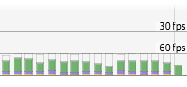
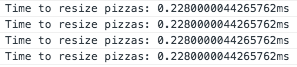

## Website Performance Optimization portfolio project

***

My project optimizing a portfolio website for the Udacity [Critical Rendering Path course](https://www.udacity.com/course/ud884).

I completed this project using techniques to optimize HTML, CSS and JavaScript in order to improve website page speed and user experience for both mobile and desktop environments.

For testing I ran the site on a local server:
```
$> python -m SimpleHTTPServer 8080
```

and ran ngrok to access it remotely:
```
$> ngrok 8080
```

***

## Part 1: Optimize PageSpeed Insights score for index.html

**Goal of Part 1:**

* Identify and perform optimizations to achieve a PageSpeed score of 90 for index.html.
* Identify and perform optimizations impacting content efficiency.

**Bonus:**

* Identify and perform optimizations to achieve a PageSpeed score above 90 for index.html.
* Research, identify and use build tools (Grunt) to automatically perform content efficiency optimizations.

**To achieve this I performed the following optimizations / changes:**

 * Loaded JavaScript files asynchonously (Google Analytics)
 * Used a media query for print.css
 * Used a smaller/optimized version of pizzeria.jpg
 * Optimized image sizes
 * Used uncss to remove any unnecessary CSS selectors
 * Checked if any CSS selectors were unnecssary for above-the-fold content
 * Moved to using Grunt to more easily make optimizations
 * grunt-imageoptim --> optimized images
 * grunt-uncss --> remove unnecessary CSS
 * grunt-contrib-uglify --> Minify Javascript
 * grunt-contrib-cssmin --> Minify CSS
 * Inlined the Open Sans Webfont into the CSS
 * Inlined a minified version of the critical CSS
 * Inlined small JavaScript files to prevent additional roundtrips
 * grunt-inline --> automate inlining of CSS and Javascript
 * grunt-contrib-htmlmin --> Minify HTML
 * Added a src/ folder to contain pre-minified html/css/js files
 * Enjoyed using the grunt tasks to incrementally improve results
 * Used grunt-pagespeed to automate command line PageSpeed Insights results

I moved the development versions of the HTML/CSS/Javascript files into a src directory and src/css, src/js subdirectories.  The grunt tasks automate the process of minifying CSS and Javascript (grunt-contrib-uglify & grunt-contrib-cssmin), inlining selected CSS and Javascript (grunt-inline), inlining the HTML (grunt-contrib-htmlmin) and moving the release files into their final locations.

**Results:**

* Ultimately achieved a mobile PageSpeed Insights score of 96
* Yay - 96 PageSpeed score -- Success!


* An automated Grunt pipeline to easily make further optimizations and see immediate PageSpeed results in the terminal.
* Note: I did not optimize the backend/server (browser caching and server response time) as this was not possible using the SimpleHTTPServer and ngrok tools.

### Resources Used For Part 1:

**Primary Course**

[Udacity Website Optimization Course](https://www.udacity.com/course/ud884)

**Additional videos**

* [Talk by Ilya Grigorik: Breaking the 1000 ms mobile barrier - Velocity NYC 2013](https://www.youtube.com/watch?v=I4vX-twze9I)
* [Ask the Experts: Web Performance - Critical Rendering Path](https://www.youtube.com/watch?v=8UIyXKflsFA)

**Testing Performance**

* [Pagespeed Insights Chrome Extension](https://developers.google.com/speed/pagespeed/insights_extensions)
This is not as up to date as the online version of Pagespeed.
* [webpagetest.org - Test website performance](http://www.webpagetest.org/)

**CSS Optimization**

* [Suggestion to to remove unused CSS](https://developers.google.com/speed/docs/insights/PrioritizeVisibleContent#RemoveUnusedCSS)
* [uncss - tool to remove unused CSS](https://github.com/giakki/uncss)
Used uncss to remove any unused css selectors.
Very few CSS selectors removed.
* [Detecting Critical CSS for above the fold content](http://addyosmani.com/blog/detecting-critical-above-the-fold-css-with-paul-kinlan-video/)
* [Bookmarkleter](http://chriszarate.github.io/bookmarkleter/)
Ran on page to detect above the fold css. As virutally the entire page is visible, all the CSS is required to render the above-the-fold content. :)  Good reference for larger pages though!

**Webfonts**

* [Webfont Optimization](https://developers.google.com/web/fundamentals/performance/optimizing-content-efficiency/webfont-optimization)
* [Webfont loader](https://github.com/typekit/webfontloader)

**Grunt**

I moved to using Grunt to automate a number of the optimization tasks.

* [Grunt for Web Optimization](http://yeoman.io/blog/performance-optimization.html)
* [Sample Gruntfile](http://gruntjs.com/sample-gruntfile)
* [grunt-contrib-jshint](https://github.com/gruntjs/grunt-contrib-jshint) - task used to lint Javascript files
* [grunt-uncss](https://github.com/addyosmani/grunt-uncss) - task for uncss
* [grunt-imageoptim](https://github.com/JamieMason/grunt-imageoptim) - task for optimizing images
* [grunt-contrib-uglify](https://github.com/gruntjs/grunt-contrib-uglify) - task to minify Javascript
* [grunt-contrib-cssmin](https://github.com/gruntjs/grunt-contrib-cssmin) - task to minify css
* [grunt-inline](https://github.com/chyingp/grunt-inline) - task to inline critical CSS and Javascript
* [grunt-contrib-htmlmin](https://github.com/gruntjs/grunt-contrib-htmlmin) - task to minify HTML
* [grunt-pagespeed](https://github.com/jrcryer/grunt-pagespeed/) - task to automate Google PageSpeed Insights

PageSpeed Insights - [More on integrating ngrok, Grunt and PageSpeed.](http://www.jamescryer.com/2014/06/12/grunt-pagespeed-and-ngrok-locally-testing/)

***

##Part 2: Optimize Frames per Second in pizza.html

**Goal of Part 2:**

* Identify and perform optimizations ensuring a consistent frame rate at 60fps when scrolling in pizza.html
* Time to resize pizzas is less than 5 ms in pizza.html shown in the browser console.
* Identify and perform optimizations impacting content efficiency.

**Bonus:**

* Research, identify and use build tools (Grunt) to automatically perform content efficiency optimizations.

**To achieve this I performed the following optimizations / changes:**

 * Primary optimizations included changes to main.js to remove unnecessary work from 'for' loops
 * Wrote a new function determineNewWidth(size) to do a much simpler width calculation when resizing pizzas.
 * Used a smaller/optimized version of pizzeria.jpg
 * Optimized image sizes
 * Used uncss to remove any unnecessary CSS selectors (bootstrap-grid)
 * Moved to using Grunt to more easily make optimizations
 * grunt-imageoptim --> optimized images
 * grunt-uncss --> remove unnecessary CSS
 * grunt-contrib-uglify --> Minify Javascript
 * grunt-contrib-cssmin --> Minify CSS
 * Inlined a minified version of the critical CSS
 * grunt-inline --> automate inlining of CSS
 * grunt-contrib-htmlmin --> Minify HTML
 * Added a src/ folder to contain pre-minified html/css/js files


I moved the development versions of the HTML/CSS/Javascript files into a view/src directory and view/src/css, view/src/js subdirectories.  The grunt tasks automate the process of minifying CSS and Javascript (grunt-contrib-uglify & grunt-contrib-cssmin), inlining the CSS (grunt-inline), inlining the HTML (grunt-contrib-htmlmin) and moving the release files into their final locations.

**Results:**

* A consistent frame rate at or above 60fps when scrolling in pizza.html



* Time to resize pizzas is less than 5 ms in pizza.html shown in the browser console. (about 0.23 ms)



* An automated Grunt pipeline to easily make further optimizations.

### Resources Used For Part 2:

**Primary Course**

* [Udacity Website Optimization Course](https://www.udacity.com/course/ud884)

**Additional videos**

* [Office Hours: P4 and Nanodegree Program Questions](https://plus.google.com/events/comnga3cdvrpkjm7dvb4l71ph2o?authkey=CPbhlNSdtpiEDg)
* [Office Hours: P3 and P4, Strategies for Web Optimization](https://plus.google.com/events/cjk2bief153ofdink5eln6nv8f8)

**Optimization Resources - Tips and Tricks**

* [Optimizing Performance](https://developers.google.com/web/fundamentals/performance/ "web performance")
* [Analyzing the Critical Rendering Path](https://developers.google.com/web/fundamentals/performance/critical-rendering-path/analyzing-crp.html "analyzing crp")
* [Optimizing the Critical Rendering Path](https://developers.google.com/web/fundamentals/performance/critical-rendering-path/optimizing-critical-rendering-path.html "optimize the crp!")
* [Avoiding Rendering Blocking CSS](https://developers.google.com/web/fundamentals/performance/critical-rendering-path/render-blocking-css.html "render blocking css")
* [Optimizing JavaScript](https://developers.google.com/web/fundamentals/performance/critical-rendering-path/adding-interactivity-with-javascript.html "javascript")
* [Measuring with Navigation Timing](https://developers.google.com/web/fundamentals/performance/critical-rendering-path/measure-crp.html "nav timing api")
* [The fewer the downloads, the better](https://developers.google.com/web/fundamentals/performance/optimizing-content-efficiency/eliminate-downloads.html)
* [Reduce the size of text](https://developers.google.com/web/fundamentals/performance/optimizing-content-efficiency/optimize-encoding-and-transfer.html)
* [Optimize images](https://developers.google.com/web/fundamentals/performance/optimizing-content-efficiency/image-optimization.html)
* [HTTP caching](https://developers.google.com/web/fundamentals/performance/optimizing-content-efficiency/http-caching.html)
* [Chrome Dev Tools tips-and-tricks](https://developer.chrome.com/devtools/docs/tips-and-tricks) - FPS Counter/HUD Display
* [User Timing API](http://www.html5rocks.com/en/tutorials/webperformance/usertiming/)
* [pngmini](http://pngmini.com/) - tool to reduce PNG size
